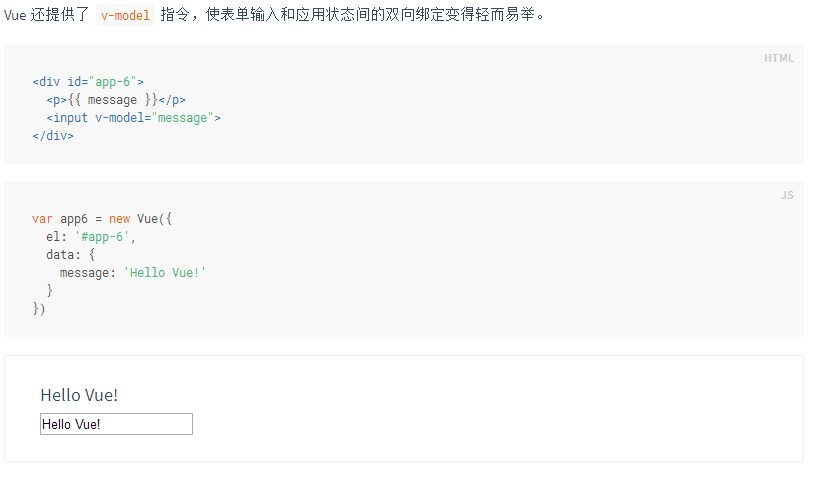
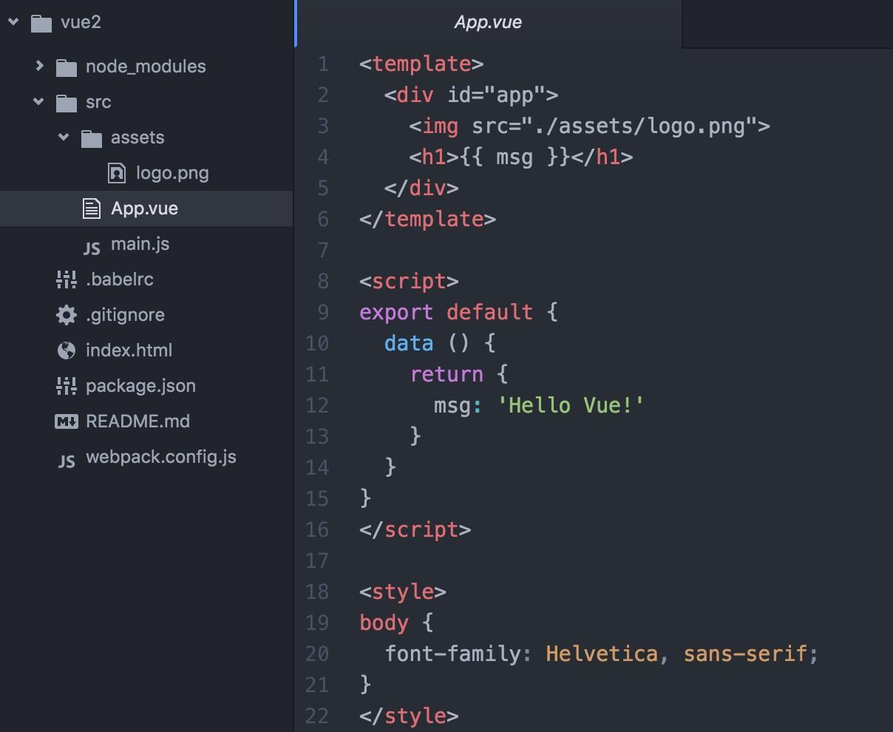
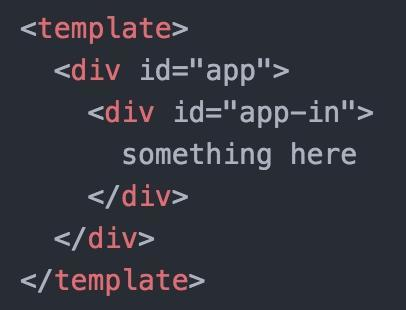
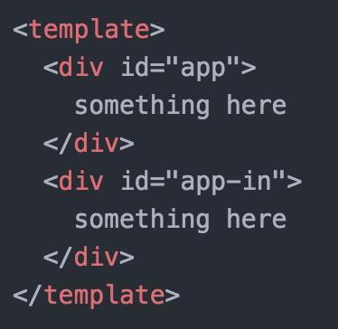
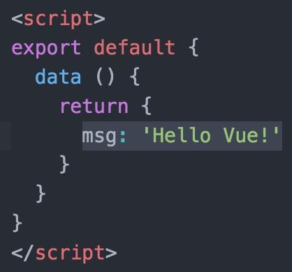
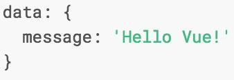
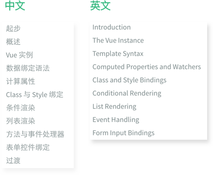
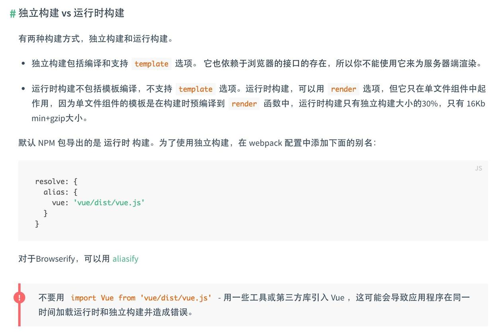
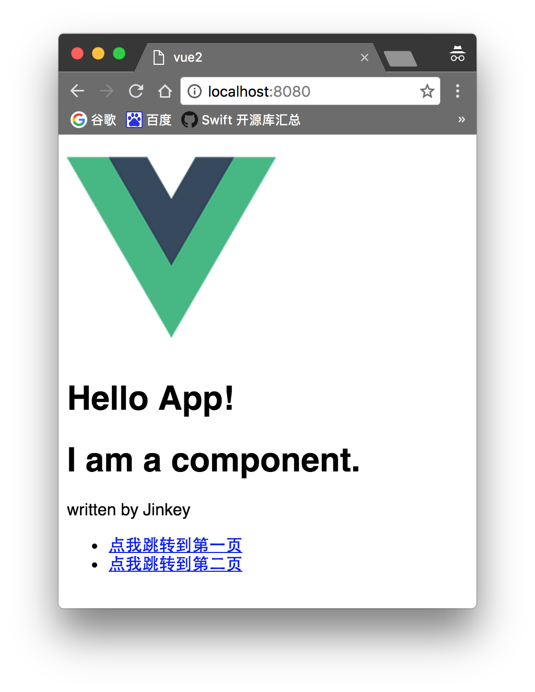
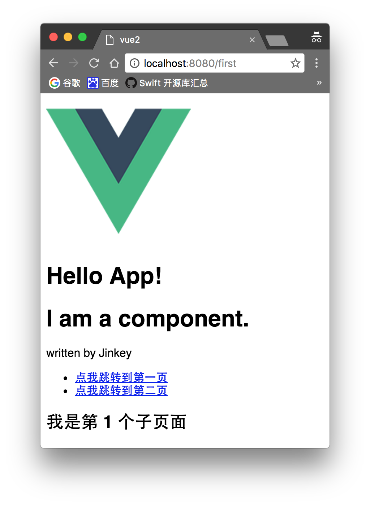

## 一、安装环境
***
打开终端运行以下命令：
1. 安装 nodejs
2. 安装淘宝镜像: `npm install -g cnpm --registry= https://registry.npm.taobao.org`
3. 安装webpack: `cnpm install webpack -g`
4. 安装vue脚手架: 
``` bash
# 全局安装 vue-cli
$ cnpm install --global vue-cli
# 创建一个基于 webpack 模板的新项目
$ vue init webpack my-project
# 安装项目依赖(注：不要从国内镜像cnpm安装,会导致后面缺了很多依赖库)
$ cd my-project
$ npm install
```
5. 安装 vue 路由模块 `vue-router` 和官方推荐的Ajax插件 `Axios`
``` bash
cnpm install vue-router axios --save
```
6. 启动项目: `npm run dev`
#### 模块丢失问题的解决办法
如果启动项目时遇到: `Module build failed: Error: Cannot find module '模块名'`

那就安装： 

* `cnpm install 模块名 --save-dev` (关于环境的，表现为npm run dev 启动不了)

* `cnpm install 模块名 --save` (关于项目的，比如main.js，表现为npm run dev 成功之后控制台报错)

比如escape-string-regexp、strip-ansi、has-ansi、is-finite、emojis-list

## 二、开始 Vue 之旅
***
### 1.使用官网文档学习基础
我们来看官网的一个例子：



打开 工程目录下的 App.vue

template 写 html，script写 js，style写样式



为了方便叙述，我们把官网例子写在同一个组件内

这里有两个坑:

1. 一个组件下只能有一个并列的 div，可以这么写，所以复制官网示例的时候只要复制 div 里面的内容就好。



但是不能这样写:



2. 数据要写在 return 里面而不是像文档那样子写



错误的写法:



这样子可以自己啃完官网文档组件之前的部分了。



***
### 2.来玩玩组件

前面讲得基本上都是各种常用组件的数据绑定，下面还得说说的是 Vue 的组件的使用。

在工程目录 /src 下创建 component 文件夹，并在 component 文件夹下创建一个 firstcomponent.vue 并写仿照 App.vue 的格式和前面学到的知识写一个组件。

``` javascript
<template>
  <div id="firstcomponent">
    <h1>I am a title.</h1>
    <a> written by {{ author }} </a>
  </div>
</template>

<script type="text/javascript">
export default {
  data () {
    return {
      author: "Liang Xu"
    }
  }
}
</script>

<style>
</style>
```

然后在 App.vue 使用组件 ( 因为在 index.html 里面定义了`<div id="app"></div>`所以就以这个组件作为主入口，方便 )

###### 第一步，引入。在 <script></script> 标签内的第一行写

``` javascript
import firstcomponent from './component/firstcomponent.vue'
```


##### 第二步，注册。在 script 标签内的 data 代码块后面加上 `components: { firstcomponent }`。 **记得中间加英文逗号!!!**

``` javascript
export default {
  data () {
    return {
      msg: 'Hello Vue!'
    }
  },
  components: { firstcomponent }
}
```


##### 第三步，使用。
在 `<template></template>` 内加上`<firstcomponent></firstcomponent>`

``` html
<template>
  <div id="app">
    
    <h1>{{ msg }}</h1>
    <firstcomponent></firstcomponent>
  </div>
</template>
```

这时候看看浏览器上的 [http://localhost:8080/](http://localhost:8080/) 页面(之前打开过就会自动刷新)，如果你没看到效果是因为你没有对 App.vue 和 firstcomponent.vue 进行保存操作，保存后页面会自动刷新。

***

### 3.使用路由搭建单页应用

之前已经通过命令安装了vue-router: `cnpm install vue-router --save`

在 webpack.config.js 加入别名

``` javascript
resolve: {
    alias: {vue: 'vue/dist/vue.js'}
  }
```
为什么要加 alias 配置项？其作用可以在文档中有相应的描述:



修改完之后的 webpack.config.js 是这样子的:

``` javascript
var path = require('path')
var webpack = require('webpack')

module.exports = {
  entry: './src/main.js',
  output: {
    path: path.resolve(__dirname, './dist'),
    publicPath: '/dist/',
    filename: 'build.js'
  },
  resolveLoader: {
    root: path.join(__dirname, 'node_modules'),
  },
  module: {
    loaders: [
      {
        test: /\\.vue$/,
        loader: 'vue'
      },
      {
        test: /\\.js$/,
        loader: 'babel',
        exclude: /node_modules/
      },
      {
        test: /\\.(png|jpg|gif|svg)$/,
        loader: 'file',
        query: {
          name: '[name].[ext]?[hash]'
        }
      }
    ]
  },
  resolve: {
    alias: {vue: 'vue/dist/vue.js'}
  },
  devServer: {
    historyApiFallback: true,
    noInfo: true
  },
  devtool: '#eval-source-map'
}

if (process.env.NODE_ENV === 'production') {
  module.exports.devtool = '#source-map'
  // http://vue-loader.vuejs.org/en/workflow/production.html
  module.exports.plugins = (module.exports.plugins || []).concat([
    new webpack.DefinePlugin({
      'process.env': {
        NODE_ENV: '"production"'
      }
    }),
    new webpack.optimize.UglifyJsPlugin({
      compress: {
        warnings: false
      }
    })
  ])
}
```

再按之前的方法写一个组件 secondcomponent.vue

``` javascript
<template>
  <div id="secondcomponent">
    <h1>I am another page</h1>
    <a> written by {{ author }} </a>
    <p> 感谢 <a href="https://github.com/showonne">showonne</a>大神的技术指导</p>
  </div>
</template>

<script>
export default {
  data() {
    return {
      author: "Liang Xu",
      articles: [],
    }
  }
  }
}
</script>

<style>
</style>
```

这时候修改 main.js，引入并注册 vue-router

``` javascript
import VueRouter from "vue-router";
Vue.use(VueRouter);
```

并且配置路由规则和 app 启动配置项加上 router，旧版的 router.map 方法在 vue-router 2.0 已经不能用了。修改后的 main.js 如下:

``` javascript
import Vue from 'vue'
import App from './App.vue'
import VueRouter from "vue-router";
import VueResource from 'vue-resource'

//开启debug模式
Vue.config.debug = true;

Vue.use(VueRouter);
Vue.use(VueResource);

// 定义组件, 也可以像教程之前教的方法从别的文件引入
const First = { template: '<div><h2>我是第 1 个子页面</h2></div>' }
import secondcomponent from './component/secondcomponent.vue'

// 创建一个路由器实例
// 并且配置路由规则
const router = new VueRouter({
  mode: 'history',
  base: __dirname,
  routes: [
    {
      path: '/first',
      component: First
    },
    {
      path: '/second',
      component: secondcomponent
    }
  ]
})

// 现在我们可以启动应用了！
// 路由器会创建一个 App 实例，并且挂载到选择符 #app 匹配的元素上。
const app = new Vue({
  router: router,
  render: h => h(App)
}).$mount('#app')
```

这样子改完再打开浏览器看看。



点击那两个链接试试，会发现 `<router-view class="view"></router-view>` 的内容已经展示出来，同时注意 **浏览器地址已经变更** 。



***

### 4.给页面加点动态数据

这时候的页面都是静态的(数据在写程序的时候已经固定了不能修改)，而每个应用基本上都会请求外部数据以动态改变页面内容。原来有一个库叫 vue-resource ，但是官方已经不再更新，他们推荐了另一个非常优秀的Ajax请求插件帮我们解决这个问题，那就是`Axios`。

使用命令行安装

``` bash
cnpm install axios --save
```

在 main.js 引入并注册 Axios:( 此处的注册方法是修改原型链，其他方法参考 **[这篇博客](http://www.cnblogs.com/wisewrong/p/6402183.html)** )

``` javascript
import axios from 'axios'
Vue.prototype.$http = axios
```

**注意：即使已经在 main.js 中引入了 axios，并改写了原型链，也无法在 Vuex 的仓库 store.js 中直接使用 $http 命令**

我们在 secondcomponent.vue 上来动态加载数据

添加一个列表:

``` html
<ul>
    <li v-for="article in articles">
        {{article.title}}
    </li>
</ul>
```

在 data 里面加入数组 articles 并赋值为[]

然后在 data 后面加入加入钩子函数 mounted (详细请参照官方文档关于 vue 生命周期的解析)， data 和 mount 中间记得记得加逗号

``` javascript
mounted: function() {
    this.$http.jsonp('https://api.douban.com/v2/movie/top250?count=10', {}, {
        headers: {

        },
        emulateJSON: true
    }).then(function(response) {
      // 这里是处理正确的回调

        this.articles = response.data.subjects
        // this.articles = response.data["subjects"] 也可以

    }, function(response) {
        // 这里是处理错误的回调
        console.log(response)
    });
  }
```

这里使用的是豆瓣的公开 GET 接口，如果接口是跨域的 POST 请求，则需要在服务器端配置:

`Access-Control-Allow-Origin: *`

这时候运行看看。等一会接口返回数据，咦，数据加载出来了，棒棒哒 !

***

### 5.来拯救如此难看的界面

组件、双向绑定、路由、数据请求等基本特性都能用了，写到这里一个单页应用基本上成型了。但是，这几面也太 TM 难看了吧。自己写 UI 框架太费劲？那就上网找一个吧。

`iView` 是一套基于 Vue.js 的开源 UI 组件库，主要服务于 PC 界面的中后台产品。

#### 安装:

``` bash
cnpm install iview --save
```

#### 使用：

参考官方文档：[iView](https://www.iviewui.com/docs/guide/start)

***

### 6.webpack打包

***

### 7.完成