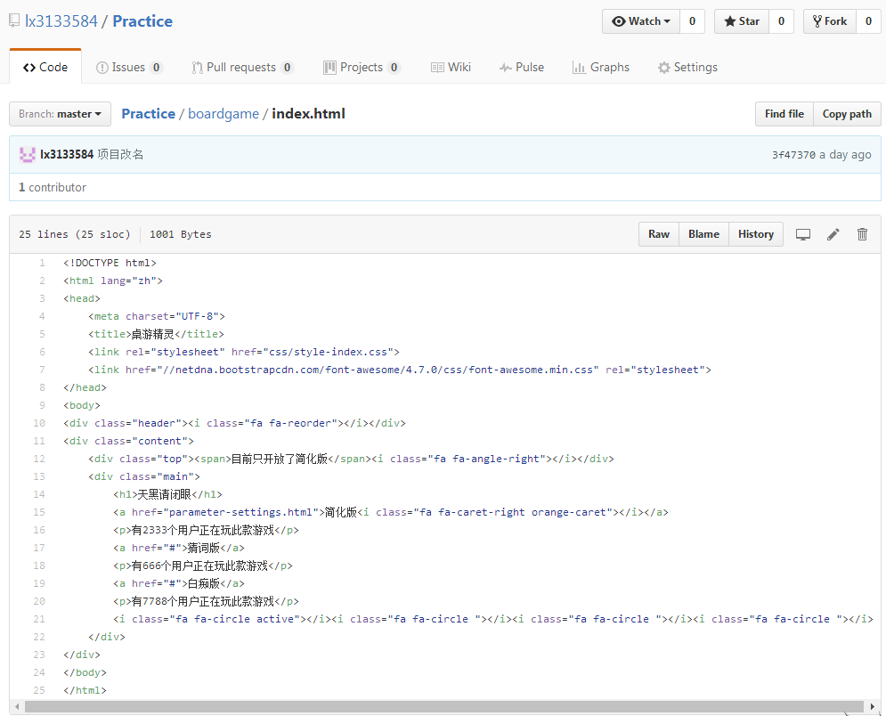
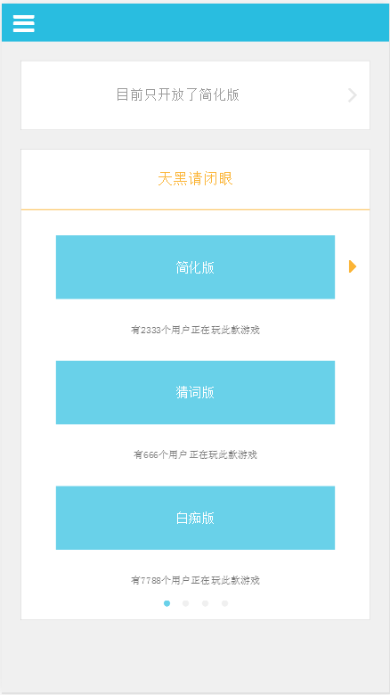

在Github上看一些项目的时候，想要看一下别人展示的DEMO，以前都是下载下来在客户端打开的。今天学到了一种方法，可以直接在网上预览DEMO。

在Github上托管的项目, 经常会存放一些demo的html文件在里面, 比如像下面这样的:

我们现在只能看到html源代码, 那么有没有什么办法直接看html网页效果而不用下载呢?

### 举个栗子:

我们要打开的项目连接是：
>`https://github.com/lx3133584/Practice/blob/master/boardgame/index.html`

我们加上前缀：
>`http://htmlpreview.github.com/?`

最终连接：
>`http://htmlpreview.github.com/?https://github.com/lx3133584/Practice/blob/master/boardgame/index.html`

#### 效果如图:

