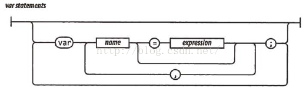
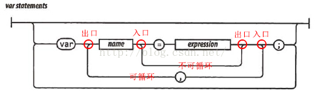

在学习《JavaScript语言精粹》的时候，遇到了一种叫做铁路图的东西，对其百思不得其解。经过查找资料和分析，总结出如下规律。

## 简介
铁路图（railroad diagram)，又叫语法图(syntax diagrams)，是一种表示形式语法的方式，是巴科斯范式和扩展巴科斯范式的图形化表示。

## 基本规则
* 从左边界开始，沿着轨道到右边界。
* 沿途，你在圆框中遇到的是字面量，在方块中遇到的是规则或描述。
* 任何沿着轨道能走通的序列都是合法的。
* 任何不能沿着轨道走通的序列都是非法的。
* 末端只有一个竖条的铁路图，表示允许在任意一对符号中插入空白。而在末端有两个竖条的铁路图则不允许。

## 示例
以javascript的声明变量的语法为例：



则从上到下语法如下：

1. 空
2. 中间横向语句。
``` javascript
var name = expression;
```
3. 从name和=之间绕行。
``` javascript
var name; 
```
4. 在expression和;之间循环。
``` javascript
var name, name,...,name;
var name = expression, name = expression,..., name = expression;
```
5. 在分号之后循环。
``` javascript
var name = expression;  
        var name = expression;  
        ... 
        
```
注：圆角向内表示循环，向外则不循环。或者将左下弧理解为出口，右下弧理解为入口。

